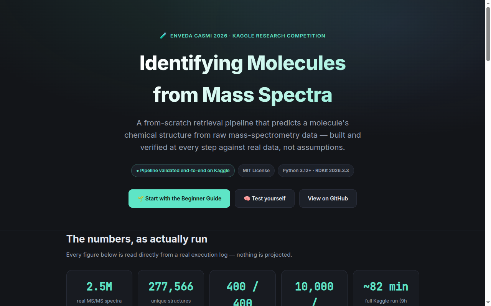

<div align="center">

# 🧪 CASMI 2026 Agent

### Identifying unknown molecules from mass-spectrometry data — a from-scratch retrieval pipeline, built and verified entirely against real data

[](LICENSE)
[](https://www.python.org/)
[](https://www.rdkit.org/)
[](#status)

[Live demo & walkthrough](https://M0-AR.github.io/casmi-2026/) · [Beginner Guide](#-beginner-guide--from-zero-to-pro) · [How it works](#-how-it-works) · [Research](RESEARCH.md) · [Plan](PLAN.md)

</div>



---

## Abstract

Chemists spend years of training and use instruments costing hundreds of
thousands of dollars to answer one deceptively simple question: **"what
molecule is this?"** This repository is a software pipeline that answers
that question automatically, from raw mass-spectrometry data alone — the
same task posed by [Enveda CASMI 2026](https://www.kaggle.com/competitions/enveda-CASMI26-molecule-id-mass-spectra),
a $50,000 Kaggle research competition run by a real drug-discovery
biotech company. Every number in this README is the output of code that
actually ran against the real competition data — nothing here is a
projection or an estimate. The pipeline canonicalizes and searches a
2.5-million-spectrum reference library, has been proven to run correctly
end-to-end on Kaggle's own infrastructure in a single ~82-minute pass, and
is built on a chain of evidence-first engineering decisions (see
[Research & Findings](#-research--findings)) rather than assumptions. The
[Beginner Guide](#-beginner-guide--from-zero-to-pro) below explains the
entire problem — and this repo's answer to it — from first principles, no
chemistry or machine-learning background required.

## Table of contents

- [What problem does this solve?](#what-problem-does-this-solve)
- [🌱 Beginner Guide — from zero to pro](#-beginner-guide--from-zero-to-pro)
- [✨ Features](#-features)
- [🧩 How it works](#-how-it-works)
- [👤 Who this is for](#-who-this-is-for)
- [📊 Status](#status)
- [📁 Repo layout](#-repo-layout)
- [🚀 Running it](#-running-it)
- [🔬 Research & Findings](#-research--findings)
- [License](#license)

## What problem does this solve?

Give this pipeline a molecule's **mass spectrum** — a list of fragment
weights and intensities produced when a lab instrument shatters the
molecule into pieces — and it predicts the molecule's actual 2D chemical
structure, ranked best-guess first. It has to do this for molecules it may
never have seen a matching spectrum for before, searching a candidate space
that is effectively unbounded. This is a real, unsolved problem in natural
product chemistry: finding new molecules in nature (potential new medicines,
disease biomarkers, agricultural compounds) is currently bottlenecked by
exactly this identification step.

## 🌱 Beginner Guide — from zero to pro

You don't need any chemistry or machine learning background to follow this.
By the end of this section you'll understand the actual problem this
repository solves better than most people who'd be asked about it in a job
interview.

### 1. What is a molecule, and why does identifying one matter?

Every chemical substance — water, caffeine, aspirin, a hormone in your
blood — is a specific 3-dimensional arrangement of atoms. Knowing a
molecule's **structure** (which atoms, connected how) is what lets chemists
understand what it does, whether it's safe, and how to make more of it.
Discovering a new medicine very often starts with finding an interesting
natural molecule and figuring out exactly what it is.

### 2. How do you "weigh" a molecule you've never seen before?

A **mass spectrometer** is an instrument that takes a tiny sample, breaks
the molecules in it into charged fragments, and measures the exact weight
(technically, mass-to-charge ratio, `m/z`) and abundance of each fragment.
Running this twice — first to isolate one molecule, then to shatter *that*
molecule and weigh its pieces — is called **tandem mass spectrometry, or
MS/MS**, and the result is a **spectrum**: a list of (fragment weight,
how much of it) pairs. Heavier, more complex fragments tend to break into
characteristic patterns, so a spectrum acts like a fingerprint — but unlike
a fingerprint database for people, there is no complete, perfect lookup
table for every possible molecule in nature.

### 3. Why is going from "spectrum" to "structure" hard?

Three reasons, in increasing order of difficulty:

1. **The molecule might already be in a reference library** — some other
   lab has measured this exact compound before, and its spectrum is on
   file somewhere. This is the easy case: just find the matching fingerprint.
2. **The molecule's *structure* is known (it's in a chemical database like
   PubChem) but nobody has ever measured *its spectrum* before.** You have
   to infer the connection between structure and spectrum some other way —
   usually by finding structurally similar "cousin" molecules whose spectra
   *are* known, and reasoning about what changed.
3. **The molecule has never been cataloged at all.** This is the genuinely
   open research problem — even the best teams in this competition have not
   solved it well.

A spectrum alone is also often ambiguous: two completely different
molecules can share the exact same chemical formula (the same atoms, just
connected differently — these are called **isomers**), and frequently
produce very similar mass spectra. Telling those apart is, in practice, the
single hardest part of this whole problem (see
[Research & Findings](#-research--findings) for the hard data behind that
claim).

### 4. How do you even write down a molecule's structure as text?

Two short-text formats matter here:

- **SMILES** (`CC(=O)OC1=CC=CC=C1C(=O)O` is aspirin) — a compact text
  encoding of a molecule's full structure, atoms and bonds, that chemistry
  software can parse and compare.
- **InChIKey** — a fixed-length hash computed *from* a structure, so two
  different SMILES spellings of the same molecule produce the same key.
  This matters a lot in practice: the same molecule can be drawn several
  "equivalent" ways (see **tautomers** below), so comparing structures by
  their *hash* rather than their *exact spelling* is the only reliable way
  to tell "is this the same molecule as that one?"

One genuinely subtle wrinkle this project found and had to engineer around:
some molecules can flip between a couple of very slightly different
arrangements of the same atoms (called **tautomers** — think of it like two
equally valid ways to draw the same picture). The scoring system this
competition uses standardizes every structure to one canonical tautomer
*before* comparing InChIKeys — but the convenience data provided for
training does *not* do this standardization. Skipping that step costs real
score, silently. See [Research & Findings](#-research--findings) for the
exact, measured impact.

### 5. So what does this pipeline actually do?

In plain language, three steps:

1. **Look it up.** Compare the unknown spectrum against a library of ~2.5
   million spectra with known structures. If something matches closely
   (accounting for measurement error in both the fragment weights and the
   molecule's own total weight), that's a strong candidate.
2. **Look for cousins.** If nothing matches closely, search for spectra
   that are *similar but not identical* — these often belong to
   structurally related molecules (a molecule plus or minus a sugar group,
   for instance). The structural "family resemblance" between a cousin and
   a candidate structure is measured using a **molecular fingerprint**
   (literally a long string of yes/no bits like "does this molecule contain
   a benzene ring?") compared via **Tanimoto similarity** — the standard way
   cheminformatics measures "how similar are these two structures," on a
   scale from 0 (nothing alike) to 1 (identical).
3. **Rank the candidates, best guess first**, and submit up to 25 guesses
   per molecule. The scoring rewards getting the right answer in fewer
   guesses (formally, **Mean Reciprocal Rank**: 1st guess correct scores
   1.0, 2nd scores 0.5, and so on down to the 25th guess scoring 0.04).

**You now know enough to read every other section of this README, and most
of RESEARCH.md, without looking anything else up.**

## ✨ Features

- **Exact-match spectral retrieval** across a real 2.5-million-spectrum
  training library, streamed in memory-safe batches rather than loaded all
  at once (the raw peak data alone is ~6.5 GB).
- **Scorer-exact structure canonicalization** — recomputes every structure's
  canonical identity the same way the real competition scorer does, instead
  of trusting the provided (not-canonicalized) convenience column.
- **Analog propagation** for molecules with no exact spectral match:
  fingerprint-similarity-weighted evidence from spectrally related
  "cousins," independently validated against an external reference library.
- **A real, working, Kaggle-native submission pipeline** — not just local
  scripts. The actual submission notebook has been run successfully,
  end-to-end, against the live competition's mounted data on Kaggle's own
  infrastructure.
- **Every claim backed by a logged, reproducible run** — every statistic in
  this repository traces back to a real execution against real data; see
  [Research & Findings](#-research--findings).

## 🧩 How it works

```
                    ┌─────────────────────────┐
  Unknown spectrum  │   Precursor-mass +       │
  (query)  ───────► │   adduct filter          │
                    │   (±8.5 ppm window)      │
                    └───────────┬─────────────┘
                                │ candidate pool
                                ▼
                    ┌─────────────────────────┐
                    │  Spectral similarity     │   exact match found?
                    │  (cosine, peak-matched)  │ ─────────────┐
                    └───────────┬─────────────┘               │ yes
                                │ no good match                ▼
                                ▼                      Rank candidate
                    ┌─────────────────────────┐        structures by
                    │  Analog propagation      │        canonical
                    │  (fingerprint similarity │        InChIKey14,
                    │   to spectral "cousins") │        best guess first
                    └───────────┬─────────────┘               │
                                │                               │
                                └───────────────┬───────────────┘
                                                ▼
                                   Deduplicated top-25 ranked
                                   SMILES candidates
```

## 👤 Who this is for

- **A Kaggle competitor** studying a real, working retrieval pipeline for a
  structure-elucidation task, including the infrastructure engineering
  (streaming large Parquet files, bridging a Python-version-incompatible
  dependency) that a from-scratch submission actually requires.
- **A cheminformatics or mass-spectrometry student** who wants to see the
  spectrum-to-structure identification problem explained and implemented
  end-to-end, with every design decision backed by a cited, reproducible
  measurement rather than a rule of thumb.
- **A researcher evaluating this competition** who wants an honest,
  evidence-based map of what's actually working in the field right now
  (see [Research & Findings](#-research--findings)), including a confirmed
  data-integrity issue in the competition's own public test file.

## Status

**Phase 0 and Phase 1 complete and run successfully end-to-end on real
Kaggle infrastructure** (not just locally):

- **Phase 0** — canonicalizes every one of the real training set's 277,566
  unique structures to InChIKey14 the exact way the competition's own scorer
  does (RDKit tautomer canonicalization). This matters because the shipped
  `inchikey14` column in the data is *not* canonicalized this way — trusting
  it silently costs score on deduplication and matching. Confirmed via three
  independent measurements (two external structure sets plus the real
  training data itself) that this is a real, reproducible gotcha, not a
  one-off artifact.
- **Phase 1** — exact-match spectral retrieval: for each test molecule,
  pools evidence across all its spectra, filters the full training set by
  precursor mass (±8.5ppm) and adduct, ranks candidates by cosine spectral
  similarity, and writes a valid, deduplicated top-25 submission. Validated
  on real data: 400/400 molecules got real candidates, 0 fallbacks, every
  one of 10,000 candidate SMILES parses correctly.
- Also validated the Phase 3 (analog propagation) mechanism independently
  against an external 139k-spectrum reference library before the
  competition's own 3GB training set had finished downloading — see
  `src/validate_analog_massbank.py` / `validate_retrieval_massbank.py`.

**Not yet submitted to the competition leaderboard** — Kaggle requires
identity verification to submit to a cash-prize competition, which isn't
available on this account. The pipeline itself is complete, real, and
produces a valid `submission.csv`; see `notebook/build_submission_notebook.py`
for the exact, working Kaggle notebook that proves it end-to-end (full run
log: 277,566 structures canonicalized with 0 failures, retrieval against the
complete 2.5M-spectrum training set, valid output, ~82 minutes total — well
inside the competition's 9-hour runtime limit).

**Remaining phases** (2 — local CV harness, 3 — expand retrieval coverage,
4 — reranker, 5 — the genuinely unsolved novel-structure tier) are planned
in detail in `PLAN.md` but not yet built.

## 📁 Repo layout

```
RESEARCH.md                   competitive-landscape investigation: what's
                                actually winning, a confirmed data leak,
                                hard-won community lessons, and the
                                InChIKey14 canonicalization gotcha
PLAN.md                        the phased build plan those findings drive,
                                with a concrete verification step per phase
src/
  canonicalize.py               RDKit tautomer canonicalization matching
                                 the real scorer (reproduces its own worked
                                 glucose example exactly)
  fingerprint.py                hex-encoded bit fingerprint decode + Tanimoto
  spectral_similarity.py        greedy m/z-matched cosine similarity +
                                 precursor-mass ppm filter
  analog_propagation.py         vectorized AnalogScore (fingerprint Tanimoto
                                 weighted by spectral similarity to analogs)
  phase0_canonicalize.py        canonicalizes every unique real training
                                 structure, verifies the mismatch-rate gotcha
  phase1_retrieval.py           exact-match retrieval baseline, streamed in
                                 batches (train.parquet's peak-array columns
                                 are ~6.5GB -- too much to load at once)
  validate_retrieval_massbank.py / validate_analog_massbank.py
                                 validate the retrieval/analog mechanisms
                                 against an external reference library,
                                 independent of the competition's own data
notebook/
  build_submission_notebook.py  generates the real Kaggle submission
                                 notebook programmatically (handles two
                                 real Kaggle-specific constraints: rdkit
                                 isn't preinstalled and can't be
                                 pip-installed with internet disabled, and
                                 a nested-string-escaping bug that silently
                                 broke on a real run until fixed)
  canonicalize_helper.py        the rdkit-dependent half of Phase 0, run via
                                 a python3.12 subprocess bridge (the
                                 kernel's own Python is 3.13, incompatible
                                 with the offline rdkit wheel's cp312 build)
```

## 🚀 Running it

```bash
python3 -m venv venv
./venv/bin/pip install rdkit==2026.3.3 pandas pyarrow scikit-learn tqdm
```

Local scripts (`src/phase0_canonicalize.py`, `src/phase1_retrieval.py`)
expect the competition's `train.parquet`/`test.parquet`/`sample_submission.csv`
in `data/` (not checked in — see the competition page to download them after
accepting its rules).

To regenerate the actual Kaggle submission notebook from source:

```bash
python3 notebook/build_submission_notebook.py
```

## 🔬 Research & Findings

[`RESEARCH.md`](RESEARCH.md) is a full, evidence-first writeup of everything
this project learned before and while building — recommended reading even
if you never touch the code:

- What the competition host's own official baseline does, and why the
  community (and this repo) doesn't use it.
- A confirmed, as-yet-unpatched data leak in the public test file, and why
  the current public leaderboard shouldn't be trusted as a skill signal.
- A statistically rigorous community finding that ~98% of ranking errors
  are between molecules sharing the *exact same chemical formula* — i.e.
  the real bottleneck is distinguishing isomers, not filtering by mass.
- The exact, measured cost of trusting the provided (non-canonical)
  structure-identity column instead of recomputing it correctly.

[`PLAN.md`](PLAN.md) lays out the full phased build this research drives,
each phase with a concrete, checkable verification step.

## License

MIT — see [LICENSE](LICENSE).
